# Utils.lua

1. Presentation
2. Usage
3. Changelog
4. Contributing
5. License and thanks

---
## 1. Presentation
__utils.lua__ is is a light module containing mostly usefull functions such as a basic implementation of nodejs Class, or Array.
> As I come form JS to lua, I obvisouly based myself on JS

It still in really basic Beta, many bugs could occure, and as I'm kinda new to lua, somethings can be messy.
> So you should use this little module for testing, but if you trust my work you can use it as a cool module to help you.

In the future, not so long to wait, a UI manager for love2d will be added, and an event manager.

---
## 2. Usage

`adding the module:`
```lua
local utils = require("./path/to/utils")
```
the variable utils contains :
* __4__ Functions
    * strColorize
    * strDecolorize
    * inspect
    * tblClone
* __2__ Class
    * Class
    * Array
    ---
### Functions:

* `strColorize`
```lua
local str = "&bluHello&res, &redWorld&res!"
local colored = utils.strColorize(str)
print(colored)
```
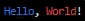

Color code always beggin with `&` or `&&` for background color and follow with the __3__ first letters of the color. for the lighter color, the fisrt letter is upper case

### colors:
```
black
red
green
yellow
blue
magenta
cyan
white
reset
```

e.g. : `&blu / &&gre / &Yel / &&Red`
* `strDecolorize`
```lua
local original = utils.strDecolorize(colored)
```
Why decolorize you string? because, when colorized you string looks messy. Exemple with `colored`:"Hello, World!".

* `inspect`
```lua
local tbl = {
                1, 2, "Hello, World!", {true, false}, 
                func=function(arg1, arg2) end,
                io.open("README.md"), 
                coroutine.create(function()end)
            }
            -- basically, here are all the types you can use in lua
print(utils.inspect(tbl))
```
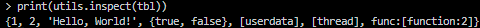

Inspect returns a string with the representation of the variable passed as argument. It can be everything
e.g. for functions : `function(arg1, arg2) end`

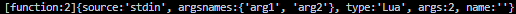

```lua
local options = {
    colors = @boolean : default = false,
    compact = @boolean : default = true,
    depth = @number or @boolean : default = false,
    maxTableLen = @number or @boolean : default = 20,
    maxStringLen = @number or @boolean : default = 160,
    customColors = @table,
}
```
* options
#### *options.colors*

If set to true the output will be colorized.
e.g. : `utils.inspect(tbl, {colors = true})`
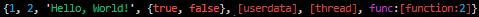

#### *options.compact*
If set to false the output will be more readable. e.g. : `utils.inspect(tbl, {compact = false})`

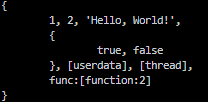

#### *options.depth*
If set to a number the output will be limited to that depth, and if false, no maximum depth will be used. e.g. : `utils.inspect(tbl, {depth = 1})`

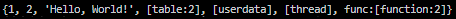

e.g. : `utils.inspect(tbl, {depth = 0})`

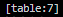

#### *options.maxTableLen*
If set to a number the table output will be limited to that length, and if false, no maximum length will be used. e.g. : `utils.inspect({1,2,3,4,5,6,7,8,9,10}, {maxTableLen = 5})`

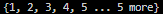

#### *options.maxStringLen*
The same as *maxTableLen* but for strings. e.g. : `utils.inspect({str="Hello, World!"}, {maxStringLen = 5})`

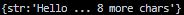

#### *options.customColors*
You can set your own colors, using the color system of *strColorize*.
```lua
local colors = {
    ["nil"] = "&red",
    boolean = "&gre",
    number = "&blu",
    string = "&yel",
    syntax = "&mag",
    builtin = "&cya",
    keyword = "&whi",
}
```
 e.g. : `utils.inspect(tbl, {customColors = colors, colors = true})`

 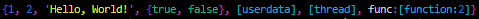

 * `tblClone`
```lua
local tbl = {1, 2, 3, 4, 5, 6, 7, 8, 9, 10}
local clone = utils.tblClone(tbl)
```
It allows to deeply clone a table. nothing more, nothing less.

### Class:
* `Class`
```lua
local Class = utils.Class
local strColorize = require("utils").strColorize

local function construct(self, name)
    print(strColorize("new &mag"..self.type.. " &resappears with name : &yel"..name))
    self.name = name
end

local kitty = {
    say=function(self, something) 
        print(strColorize("<&mag"..self.type.."&res:".."&yel"..self.name.."&res> : &blu"..something))
    end,
    age=16,
    type = "Kitty"
}
local cat = {
    age=19,
    type = "Cat"
}

Kitty = Class:extend(construct, kitty)
Cat = Kitty:extend(construct, cat)

Plume = Cat:new("Plume")
Aslan = Kitty:new("Aslan")

Plume:say("nya!")
Aslan:say("How old are you?")
Plume:say("I'm actually "..Plume.age.." years old. and you?")
Aslan:say("I'm "..Aslan.age.." years old.")
```

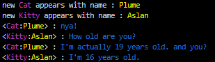

So, what are we doing here? Using Class, we create self constructing object, with "prototype" (function) and data.

## extending a Class

It's used to create a new class, that inherits prototype and data from the parent class. Using `Class:extend(construct, data)`, it return a class, which can be extended too.


* constructor
```lua
local function construct(self, name)
    print(strColorize("new &mag"..self.type.. " &resappears with name : &yel"..name))
    self.name = name
end
```
This is equivalent to the constructor in JS. When you extend a class `Class:extend(construct, data)`, each time you initialize a new class `Class:new(data)`, the constructor will be called. In our exemple, each time a `Cat` ou `Kitty` is called, the constructor print a message, and assign the data to the object. (see the code above)

* data and prototypes
```lua
local kitty = {
    say=function(self, something) 
        print(strColorize("<&mag"..self.type.."&res:".."&yel"..self.name.."&res> : &blu"..something))
    end,
    age=16,
    type = "Kitty"
}
```

Kitty will be used as the base of ou Class `Class:extend(construct, kitty)`. each function will be stored in the class.prototype for a better view of the class data, and each other data will be on the class, even when initialized `Class:new(data)`.

```lua
local cat = {
    age=19,
    type = "Cat"
}
```
In our exemple, when I have extended the class `Cat` from `Kitty`, I haven't passed a `say`prototype in the data. But `Cat:say()` still works, because it's extended from `Kitty`.

## Initializing a Class

```lua
Plume = Cat:new("Plume")
Aslan = Kitty:new("Aslan")
```
The two objects are initialized with the constructor, which can be used to store data in the Class, or trigger some events for your code, such as a debug log ect...

You can pass as many data as you want to the constructor, it's up to you!

```lua
Plume = Cat:new("Plume")
Cookie = Cat:new("Cookie")
```
And a class can be initialized multiple times. Be aware that, when initialized, a class won't have the `new` nor `extend` methods.
```lua
Plume = Cat:new("Plume")
Plume2 = Plume:extend(construc, data) --will trigger an error
Plume2 = Plume:new("Plume2") --will trigger an error too
```

Of course if you're already using Class, in other languages, you will thinks that it's some useless explanations, but I prefer to be clear and not risk a miss use.

### Array :
It's actually a copy past of JS Array Class, but in lua.
Array is a class itself, and actually not much more than a table with some methods (actually a lot of methods).

Why using Array instead of table then? There is no reason to. But the methods are useful, and It can offer a wide range of possibilities. Like extending Array class to make your own data holding table, ect... Only you can see the possibilities.

For now, It only contains a few range of methods, but as the module will be updated, some prototypes will be added, and why not a event listenner on it?

```lua
local Array = utils.Array
local array = Array:new() --empty array
local array = Array:new(10, function(i) return i+1 end) 
-- 10 is the size of the array, using a function to fill it {2, 3, 4, 5, 6, 7, 8, 9, 10, 11}
local array2 = Array:new({1, 2, 3, 4, 5, key="value"})
--array from a table {1, 2, 3, 4, 5, "value"}
local array3 = Array:new("Hello, Wolrd")
--array from a string {'H', 'e', 'l', 'l', 'o', ',', ' ', 'W', 'o', 'l', 'r', 'd'}
```
You can get the list of prototypes with `Array:getPrototype()`, which will return a table with all the prototypes name.

e.g. : `utils.inspect(array:getPrototype())`
```lua
{'reverse', 'splice', 'map', 'random', 'unshift', 'values', 'shuffle', 'includes',
 'indexOf', 'shift', 'merge', 'reduce', 'forEach', 'join', 'pop', 'split',
 'find', 'clone', 'every', 'filter', 'remove', 'sort', 'some','slice', 'push'}
```

You can use a prototype on an Array with `array:prototype(arg)`.
```lua	
local array = Array:new(10, function(i) return i end)
-- array = {1, 2, 3, 4, 5, 6, 7, 8, 9, 10}
array:reverse()
-- array = {10, 9, 8, 7, 6, 5, 4, 3, 2, 1}
array:shuffle()
-- array = {9, 10, 8, 1, 6, 2, 4, 3, 5, 7}
array:sort(function(a, b) return a < b end)
-- array = {1, 2, 3, 4, 5, 6, 7, 8, 9, 10}
local map = array:map(function(i) return i*2 end)
-- map = {2, 4, 6, 8, 10, 12, 14, 16, 18, 20}
-- array = {1, 2, 3, 4, 5, 6, 7, 8, 9, 10}
```

---
# 3. Changelog
changelog is viewable on [changelog](./CHANGLOG.md)

---

# 4. Contributing
By using this module and reporting issues, you help me to improve it.
But you can suggest me to add new features too. I can accept critics, as long as it's constructive.
Oh and english isn't my first language, so if you see some mistakes, please tell me.

# 5. License and Thanks
* [License](./LICENSE)


> You are free to use my code, and apply changes, and if you can credit me, I will be happy.

* Thanks

Thank to [Sedorriku](https://github.com/Sedorikku1949) for his precious suggestions and tests.
